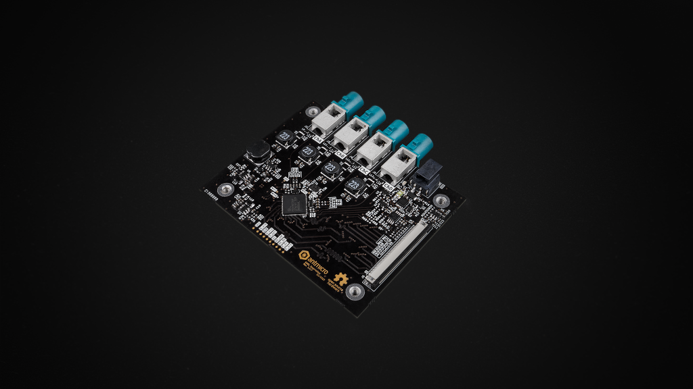

# GMSL Deserializer Board

Copyright (c) 2023-2025 [Antmicro](https://www.antmicro.com)

## Overview

This project contains open hardware design files for the Antmicro GMSL Deserializer Board, capable of translating up to 4 GMSL signals into 2x 4-lane MIPI CSI-2 interfaces. The board is designed to connect to a baseboard, e.g. [Jetson Orin Baseboard](https://github.com/antmicro/jetson-orin-baseboard), via a 50-pin Antmicro Dual Camera interface.

The design files were prepared in KiCad 8.

## Key features

* Four GMSL2 ports
* PoC circuit for providing up to 12W per GMSL line, over coaxial cable
* MIPI CSI-2 interface on a 50-pin Antmicro Dual Camera connector
* DC Power connector

## Project structure

The main directory contains KiCad PCB project files, a LICENSE, and a README.
The remaining files are stored in the following directories:

* `img` - contains graphics for this README
* `doc` - contains schematics in PDF format
* `assets` - contains visual assets for showcasing this design on [Open Hardware Portal](https://openhardware.antmicro.com).

The board exposes MIPI CSI-2 interfaces using unified 50-pin connectors that are electrically compatible with a variety of boards created by Antmicro:

* [Jetson Nano Baseboard](https://github.com/antmicro/jetson-nano-baseboard)
* [Jetson Orin Baseboard](https://github.com/antmicro/jetson-orin-baseboard)
* [SA800U (Snapdragon 845) Baseboard](https://github.com/antmicro/snapdragon-845-baseboard)
* [SC606T (Snapdragon 625) Baseboard](https://github.com/antmicro/snapdragon-625-baseboard)
* [Kria K26 Devboard](https://github.com/antmicro/kria-k26-devboard)

## Licensing

This project is published under the [Apache-2.0](LICENSE) license.
